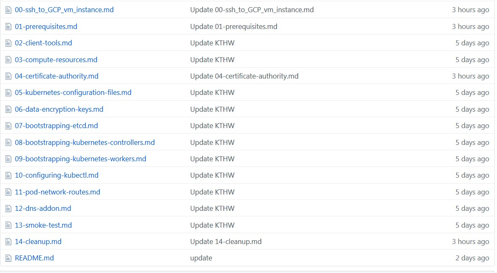

#  文档

##  vagrant way
https://github.com/kinvolk/kubernetes-the-hard-way-vagrant

# Now

[Content  ... ](https://github.com/latermonk/install-k8s-cluster-the-manual-way/tree/master/docs)

# 参考资料
## kelseyhightower   英文原版    
https://github.com/kelseyhightower/kubernetes-the-hard-way

## feiskyer 
https://github.com/feiskyer/kubernetes-handbook/blob/master/deploy/kubernetes-the-hard-way/index.md

##  opsnull
跟我一步一步安装集群         
https://github.com/opsnull/follow-me-install-kubernetes-cluster

## rootsong
在CentOS上部署kubernetes集群    
https://jimmysong.io/kubernetes-handbook/practice/install-kubernetes-on-centos.html

## kweisamx  KTHW-CN中文版  
https://github.com/kweisamx/Kubernetes-The-Hard-Way-ZH-tw

## markthink     
CKA-Kubernetes 部署模板+CKA/CKAD 指南       
https://github.com/markthink/cka-kubernetes

##  常用手册
### rootsong
https://github.com/rootsongjc/kubernetes-handbook/blob/master/SUMMARY.md

### feiskyer
https://github.com/feiskyer/kubernetes-handbook/blob/master/SUMMARY.md
