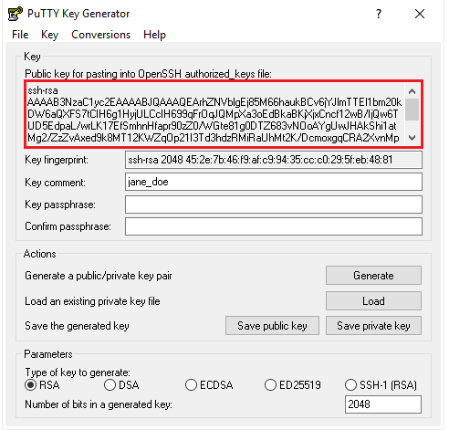
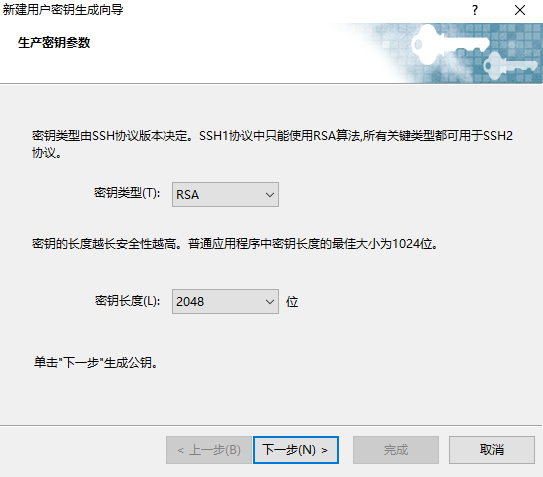
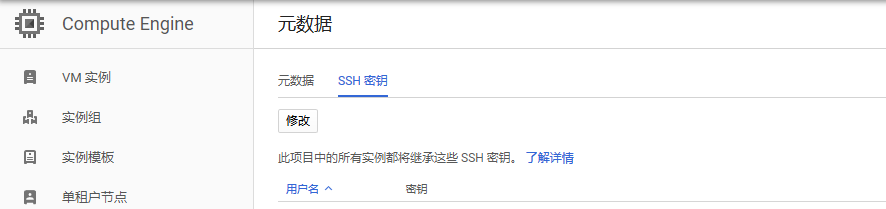
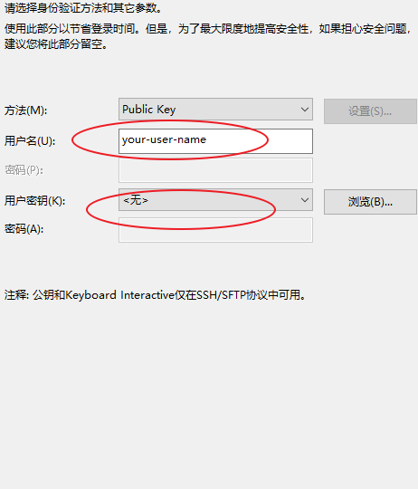

# install k8s cluster at gcp manual
https://github.com/latermonk/install-k8s-cluster-the-manual-way/tree/master/docs


# ssh

https://cloud.google.com/compute/docs/instances/adding-removing-ssh-keys#locatesshkeys


##  Create new ssh-key


## windows

### PUTTY


因此公钥为：


```
ssh-rsa [KEY_VALUE] [USERNAME]
```
其中：

KEY_VALUE 是 生成的公钥的值      
USERNAME  是需要使用的用户名     

### XSHELL





## Upload pub key to server





## XSHELL连接




